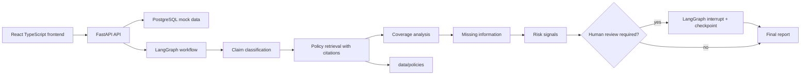
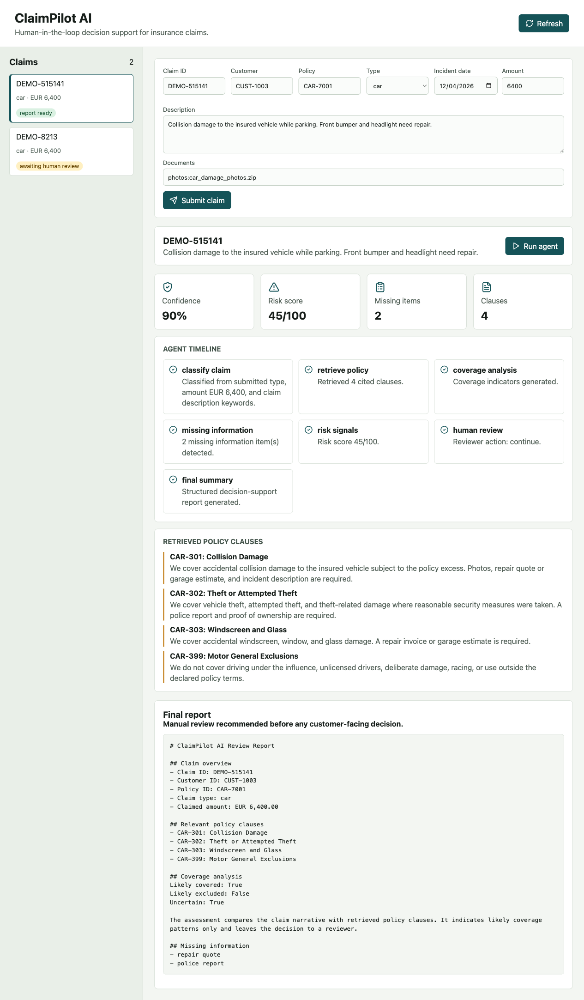

# ClaimPilot AI

ClaimPilot AI is a production-oriented portfolio project for human-in-the-loop insurance claims review. It uses FastAPI and LangGraph to classify claims, retrieve relevant fictional policy clauses, identify missing information, surface risk indicators, pause for reviewer input when needed, and generate a structured decision-support report.

The system is intentionally not an automated decision engine. It does not approve, reject, or settle claims.

## Why It Matters

Insurance and financial services teams need AI systems that are reliable, explainable, auditable, and aligned with human review obligations. ClaimPilot AI demonstrates how an agentic workflow can support a claims reviewer without replacing accountable decision-making. The design focuses on traceable policy citations, deterministic fallbacks, clear risk disclaimers, and a proper LangGraph interrupt for human oversight.

## Architecture



## LangGraph Workflow

1. `classify_claim`: classifies claim type, complexity, confidence, and reasoning summary.
2. `retrieve_policy`: retrieves relevant fictional clauses from `data/policies`.
3. `coverage_analysis`: compares the claim narrative with retrieved clauses without making a final decision.
4. `missing_information`: checks required documents such as invoices, police reports, photos, travel bookings, repair quotes, and medical certificates.
5. `risk_signals`: evaluates indicators such as high amount, outside-policy incident dates, inconsistent narrative timing, and repeated claims.
6. `human_review`: uses a LangGraph interrupt and checkpointing when confidence, uncertainty, or risk thresholds require reviewer input.
7. `final_summary`: creates JSON and readable Markdown-style report output.

## Setup

```bash
cp .env.example .env
docker compose up --build
```

Services:

- API: [http://localhost:8000](http://localhost:8000)
- API docs: [http://localhost:8000/docs](http://localhost:8000/docs)
- Frontend: [http://localhost:5173](http://localhost:5173)
- PostgreSQL with pgvector image: `localhost:5432`

Local backend only:

```bash
python3.11 -m venv .venv
. .venv/bin/activate
pip install -e ".[dev]"
uvicorn app.main:app --reload
pytest -q
```

Local frontend only:

```bash
cd frontend
npm install
npm run dev
```

## Demo Flow

1. Open the frontend dashboard.
2. Submit the prefilled car claim or create a travel, home, or car claim.
3. Run the agent workflow.
4. Inspect the node timeline, retrieved policy clauses, missing-information checklist, and risk score.
5. If the workflow pauses, add reviewer notes and choose whether to continue, request more information, or mark for manual handling.
6. Review the final structured report.

## Screenshot



## API Endpoints

- `GET /health`
- `GET /claims`
- `POST /claims`
- `GET /claims/{claim_id}`
- `POST /claims/{claim_id}/run`
- `POST /claims/{claim_id}/review`
- `GET /claims/{claim_id}/report`

## Evaluation

The evaluation module runs eight predefined fictional test claims in `data/test_cases` and checks:

- Correct policy clause retrieval.
- Expected missing-document detection.
- High-risk or uncertain claims routed to human review.
- Final report schema validity.

Run:

```bash
python -m app.evaluation.runner
pytest -q
```

## Mock Data

The project includes fictional policy documents for:

- Travel insurance.
- Home insurance.
- Car insurance.

The database seed contains fictional customers, active policies, and prior claim history. No real customer data is used.

## OpenAI and Azure OpenAI

The deterministic path is the default so tests and demos are stable. `app/services/llm.py` contains the configurable OpenAI and Azure OpenAI model factory for future LLM-backed nodes. Environment variables are included for OpenAI or Azure OpenAI integration:

- `OPENAI_API_KEY`
- `OPENAI_MODEL`
- `AZURE_OPENAI_API_KEY`
- `AZURE_OPENAI_ENDPOINT`
- `AZURE_OPENAI_DEPLOYMENT`
- `LLM_PROVIDER`

The current implementation keeps LLM use optional; the agent workflow and tests work without external API calls.

## Retrieval

Policy retrieval defaults to deterministic local scoring for repeatable tests. Set `VECTOR_STORE=chroma` to use the optional Chroma-backed retriever with deterministic hash embeddings over the same clause corpus. Docker Compose uses the `pgvector/pgvector` PostgreSQL image so the project can be extended to persistent pgvector embeddings without changing the service topology.

## Future Improvements

- Replace local keyword retrieval with persistent pgvector embeddings.
- Add reviewer authentication, role-based permissions, and immutable audit logs.
- Store generated reports as versioned PDF artifacts.
- Add LangSmith tracing for workflow observability.
- Add richer policy document chunking and clause-level metadata.
- Integrate a real document ingestion pipeline for uploaded evidence.

## Relevance For Agentic AI Roles

ClaimPilot AI shows practical agentic AI engineering for insurance and financial services: stateful orchestration, retrieval-grounded reasoning, human-in-the-loop control, deterministic testability, risk-aware routing, and explainable outputs suitable for regulated review workflows.
